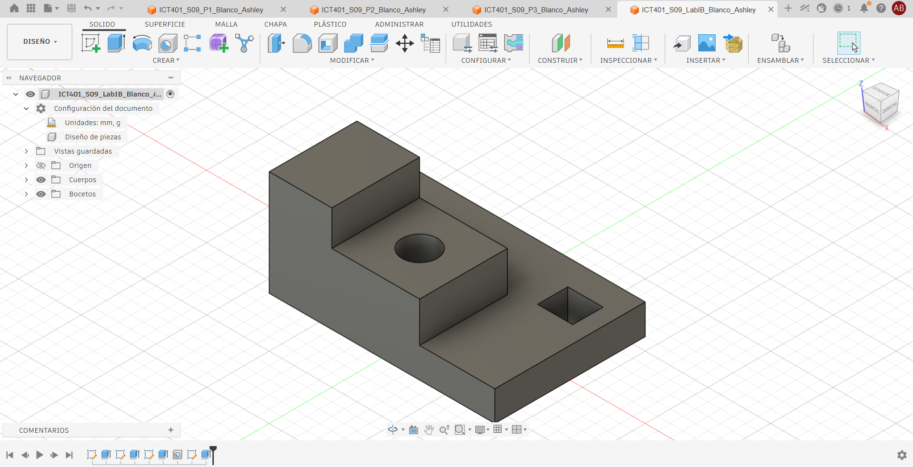
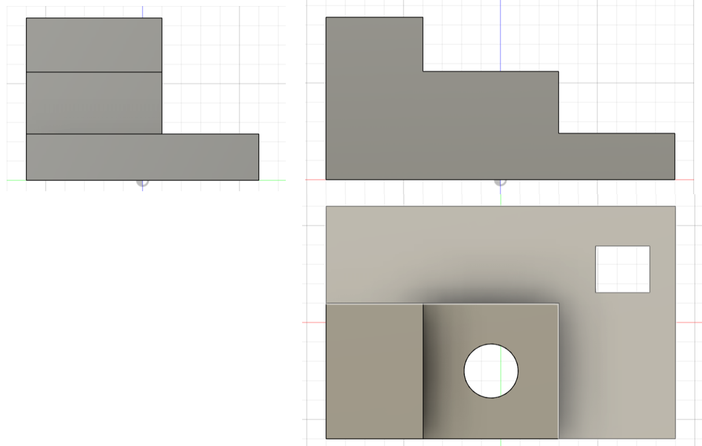
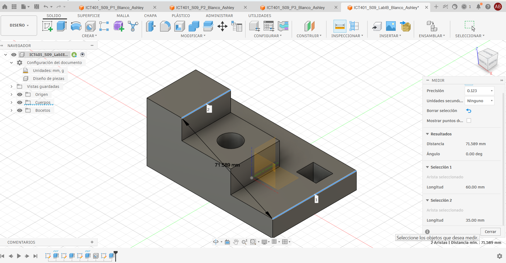

# ICT401 · Semana 9 — Laboratorio integrador I-B

**Reconstrucción 3D a partir de un plano o conjunto de vistas — 10 %**

- Estudiante: Ashley Blanco Solis
- Grupo: 60
- Fecha: 17/09/2026
- Nombre del archivo de Fusion: `ICT401_S09_LabIB_Blanco_Ashley`
- Carpeta/proyecto de Fusion Cloud con acceso docente: [Respuesta]
- Commit de entrega: [Respuesta]

## Instrucciones de uso de esta ficha

Complete esta ficha durante el laboratorio. No borre respuestas iniciales aunque luego las corrija. Cuando cambie una decisión, explique qué evidencia del plano o del modelo motivó la modificación.

La ficha debe quedar en `Laboratorio_I/I-B` con el nombre `S09_Lab_IB_Evidencias_Blanco_Ashley.md`. Las imágenes enlazadas deben estar en la misma carpeta. El archivo nativo permanece en Fusion Cloud con acceso docente.

Esta ficha forma parte de la evidencia evaluable del Laboratorio integrador I-B y está estructurada para facilitar una revisión posterior por la persona docente o mediante ChatGPT. La calificación final corresponde siempre al instrumento oficial del curso.

---

## A. Interpretación inicial del plano

### A1 · Dimensiones generales

- X total: 90
- Y total: 60
- Z total: 42

### A2 · Características geométricas identificadas

| Nº | Característica | Descripción | Vista(s) que la definen | Dimensiones asociadas |
|---|---|---|---|---|
| 1 | [Respuesta] | [Respuesta] | [Respuesta] | [Respuesta] |
| 2 | [Respuesta] | [Respuesta] | [Respuesta] | [Respuesta] |
| 3 | [Respuesta] | [Respuesta] | [Respuesta] | [Respuesta] |
| 4 | [Respuesta] | [Respuesta] | [Respuesta] | [Respuesta] |
| 5 | [Respuesta] | [Respuesta] | [Respuesta] | [Respuesta] |

### A3 · Describa la pieza en una frase técnica antes de abrir Fusion

Modelo con contorno escalonado con un agujero y una ranura

### A4 · ¿Qué plano de boceto utilizará primero y por qué?

Top, es mas facil empezar el boceto desde ese plano. y leer el ancho total y la profundidad

### A5 · Estrategia inicial de modelado

1. Rectángulo de 90x60mm y Extruir 12mm
2. Rectángulo de 60x35mm y Extruir 16mm
3. Rectángulo de 25x35mm y Extruir 14mm
4. Hole de 14mm en el centro del segundo regtangulo
5. Ranura de 14x12mm en el rectángulo base
6. Revisar y corregir

---

## B. Desarrollo del modelo

### B1 · Boceto base

- Plano seleccionado: Top.
- Geometría principal: Regtangulo.
- Restricciones aplicadas: Horizontal/Vertical y Igual.
- Dimensiones aplicadas: 90,60,25 mm de ancho. Altura de 42,28,12 mm.
- Estado del boceto: Completamente restringido.

### B2 · Operaciones principales realizadas

| Orden | Operación | Propósito geométrico | Parámetro/dimensión principal | Resultado |
|---|---|---|---|---|
| 1 | Sketch| Definir el perfil principal de la pieza | X = 90 mm/alturas del plano |  | base
| 2 | Extrude | Generar el cuerpo principal | Y = 60 mm | Cuerpo base|
| 3 | Sketch + Extrude |Crear la segunda plataforma | X = 0–60 mm; Y = 25–60 mm | Plataforma elevada |
| 4 | Sketch + Extrude | Crear la torre |X = 0–25 mm; Y = 25–60 mm  |Torre elevada |
| 5 | Hole |Crear el agujero pasante  | Ø14 mm | Agujero  |
| 6 | Sketch + Extrude | Crear la ranura pasante | 14 × 12 mm; X = 68–82 mm; Y = 10–22 mm | Ranura rectangular |

### B3 · Cambios respecto a la estrategia inicial

| Cambio realizado | Motivo | Vista/dimensión que reveló el problema | Sketch/operación corregida |
|---|---|---|---|
|No se realizó ningún cambio  | La estrategia fue correcta  | comparación entre Front, Top y Right |No fue necesario corregir |
| No se realizó ningún cambio | La estrategia fue correcta | comparación entre Front, Top y Right | No fue necesario corregir  |
| No se realizó ningún cambio | La estrategia fue correcta  |comparación entre Front, Top y Right | No fue necesario corregir  |

---

## C. Verificación contra el plano

### C1 · Correspondencia de vistas

| Vista | ¿Coincide? | Evidencia geométrica | Diferencia detectada | Corrección realizada |
|---|---|---|---|---|
| Front | Sí | Se observa el perfil escalonado con alturas de 12, 28 y 42 mm y un ancho total de 90 mm. | No se detectaron diferencias. | No fue necesaria. |
| Top | Sí | Coinciden las dimensiones generales de 90 × 60 mm, la posición de la plataforma y torre, el agujero Ø14 y la ranura de 14 × 12 mm. | No se detectaron diferencias. | No fue necesaria. |
| Right | Sí | Coinciden la profundidad total de 60 mm y los diferentes niveles de altura de la pieza. | No se detectaron diferencias. | No fue necesaria. |

### C2 · Comprobación dimensional

| Nº | Dimensión crítica | Valor del plano | Valor medido en Fusion | Elemento seleccionado | ¿Coincide? |
|---|---|---|---|---|---|
| 1 | Ancho total X | 90 mm | 90 mm | Base | Sí |
| 2 | Profundidad total Y | 60 mm | 60 mm | Base | Sí |
| 3 | Altura total Z | 42 mm | 42 mm | Torre | Sí |
| 4 | Diámetro del agujero | Ø14 mm | Ø14 mm | Agujero circular | Sí |
| 5 | Dimensiones de la ranura | 14 × 12 mm | 14 × 12 mm | Ranura rectangular | Sí |

### C3 · Editabilidad paramétrica

Si una dimensión principal de la pieza cambiara, indique qué Sketch, dimensión u operación tendría que editar y por qué.

Para cambiar el tamaño general de la pieza se editaría el Sketch de la base y sus dimensiones de 90 mm y 60 mm. Para modificar la altura de la plataforma se editaría la extrusión de 16 mm, mientras que para modificar la altura de la torre se editaría la extrusión de 14 mm. El diámetro y la posición del agujero se modificarían desde su Sketch, y las dimensiones o posición de la ranura desde el Sketch utilizado para crearla.

---

## D. Evidencias

### D1 · Modelo final

Modelo completo en orientación pictórica, con nombre del diseño y ViewCube visibles.

### D2 · Vistas de verificación

Montaje de Front, Top y Right del modelo, presentado de manera clara para comparar con el plano base.

### D3 · Boceto y restricciones

Captura del boceto más representativo con restricciones y dimensiones visibles.

.png)

### D4 · Timeline / historial paramétrico

Captura donde se observen las operaciones principales del historial del modelo.

### D5 · Verificación dimensional

Captura de `Inspect > Measure` con una dimensión crítica y el elemento seleccionado visibles.

---

## E. Checklist de entrega

- [x ] Analicé el plano antes de comenzar el modelado.
- [x ] Registré X, Y y Z totales.
- [x ] Identifiqué las características principales y las vistas que las definen.
- [x ] Registré una estrategia inicial antes de modelar.
- [x ] El modelo final corresponde a Front, Top y Right.
- [ x] Verifiqué al menos cinco dimensiones críticas.
- [ x] Los bocetos principales tienen restricciones y dimensiones coherentes.
- [x ] El historial de operaciones es legible y editable.
- [x ] El nombre del archivo cumple la nomenclatura solicitada.
- [x ] El archivo editable está disponible en Fusion Cloud con acceso docente.
- [x ] Las cinco evidencias se visualizan correctamente en GitHub.
- [x ] Esta ficha está completa.

---

# F. Rúbrica oficial del Laboratorio integrador I-B

> Esta rúbrica reproduce los criterios y valores establecidos en el programa oficial. La persona docente puede anotar el puntaje obtenido y observaciones en las columnas finales.

| Criterio oficial | Valor máximo | Evidencia principal en esta ficha | Puntaje obtenido | Observaciones de evaluación |
|---|---:|---|---:|---|
| Interpretación correcta del plano o conjunto de vistas | 2,0 % | Secciones A1–A5 y C1 | [Evaluador] | [Evaluador] |
| Reconstrucción tridimensional coherente | 2,5 % | Secciones B1–B3, D1 y D2 | [Evaluador] | [Evaluador] |
| Aplicación de restricciones y dimensiones | 1,5 % | B1, D3 y C2 | [Evaluador] | [Evaluador] |
| Precisión geométrica y correspondencia con el plano | 2,0 % | C1, C2, D2 y D5 | [Evaluador] | [Evaluador] |
| Organización, nomenclatura y archivo editable | 1,0 % | Identificación, B2, D4 y checklist | [Evaluador] | [Evaluador] |
| Presentación y cumplimiento del enunciado | 1,0 % | Ficha completa, evidencias y checklist | [Evaluador] | [Evaluador] |
| **Total** | **10,0 %** |  | **[Evaluador]** | **[Evaluador]** |

## G. Resumen para evaluación asistida por ChatGPT

Este bloque debe permitir una revisión rápida sin tener que inferir información faltante.

- ¿El estudiante interpretó correctamente X, Y y Z? [Respuesta]
- ¿Las características listadas corresponden con el plano? [Respuesta]
- ¿La estrategia inicial es coherente? [Respuesta]
- ¿El modelo final coincide con las tres vistas? [Respuesta]
- ¿Las dimensiones críticas coinciden? [Respuesta]
- ¿Los bocetos muestran restricciones y dimensiones adecuadas? [Respuesta]
- ¿El timeline muestra una reconstrucción paramétrica razonable? [Respuesta]
- ¿El archivo y las evidencias cumplen nomenclatura y presentación? [Respuesta]
- Incidencias que el evaluador debería revisar directamente en Fusion: [Respuesta]

## H. Retroalimentación del evaluador

### Fortalezas

[Evaluador]

### Aspectos por corregir

[Evaluador]

### Calificación final

**[Evaluador] / 10,0 %**
