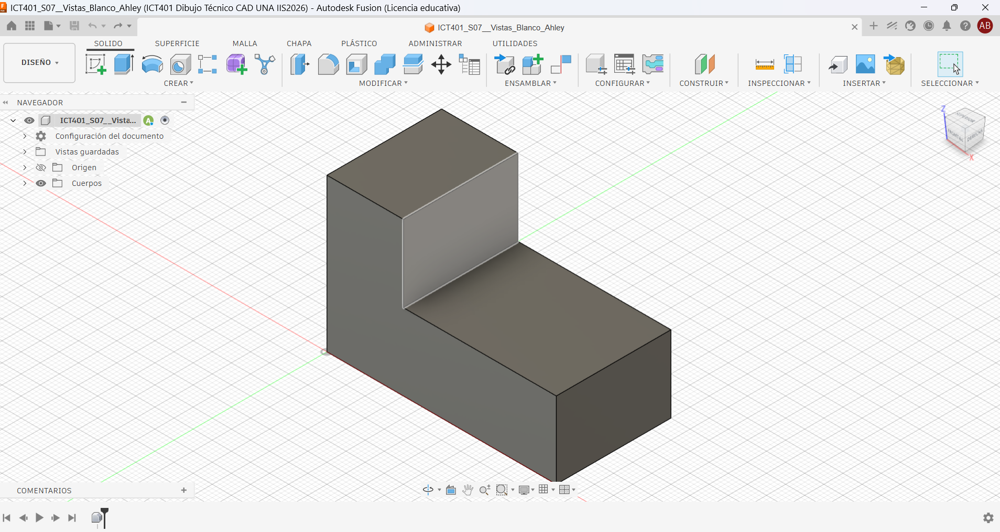
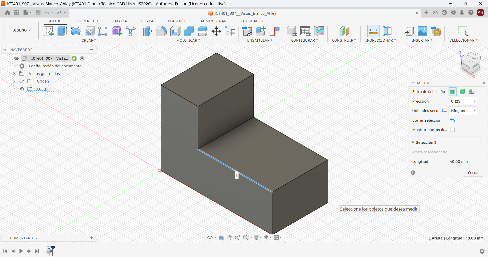
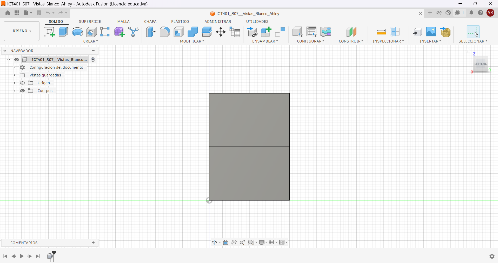
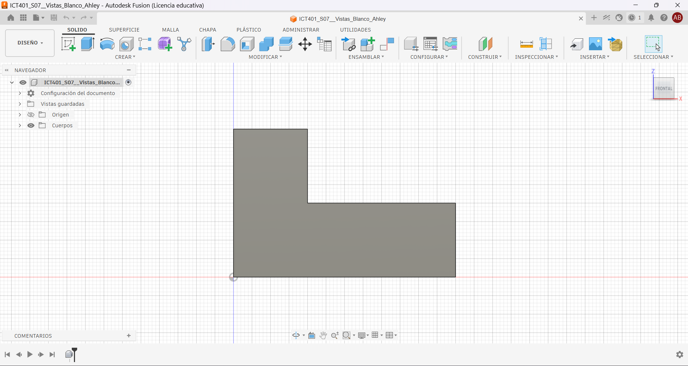
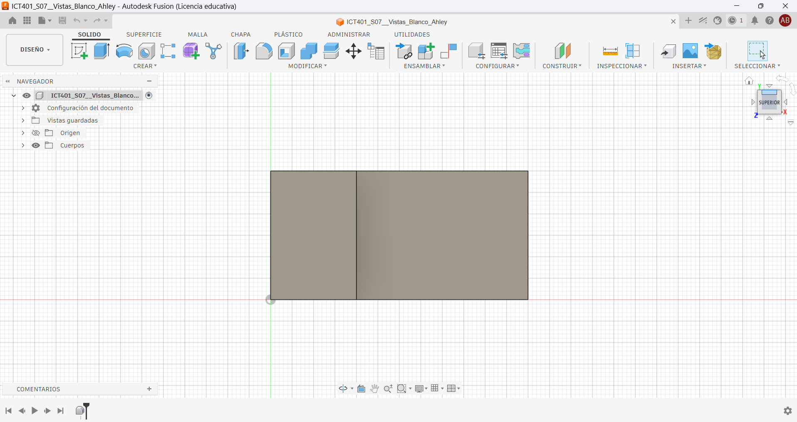

# Semana 7 — Registro de práctica en Fusion

- Estudiante: [Ashley Blanco]- Grupo: [60]- Archivo en Fusion Cloud: `ICT401_S07_Vistas_Blanco_Ashley`
- Carpeta o proyecto con acceso docente: [Portafolio/Semana07]- Sistema para disponer las vistas: primer diedro.
- Cámara de las capturas principales: ortográfica.

Antes de publicar, sustituya `Apellido_Nombre` en todos los nombres y enlaces por sus datos, sin espacios ni tildes. Guarde este archivo como `S07_Registro_Apellido_Nombre.md`, junto a las cinco imágenes en `Portafolio/semana07/`. No agregue un PDF ni fotografías de hojas.

## P1 — Predecir, observar y medir

### Predicción y comprobación

Escriba la predicción antes de seleccionar la vista en Fusion. No borre una predicción incorrecta: explique qué corrigió.

| Vista | Predicción sobre el escalón | ¿Qué observé al seleccionarla? |
|---|---|---|
| Front | [Un escalón con la parte de abajo mas larga] | [Se observa la estructura escalonada,los dos escalones tienen la misma medida de alto] |
| Top | [un rectángulo acostado con una línea un poco mas a la izquierda del medio] | [Confirmo] |
| Right | [Rectángulo con línea justo en el medio(como domino)] | [Confirmo] |

### Medidas verificadas con Inspect > Measure

Seleccione una arista completa y anote su longitud en milímetros. Identifique físicamente la arista, no solo su número o color.

| Dato | Longitud medida (mm) | ¿Qué arista seleccioné? |
|---|---:|---|
| Ancho total | [60] | [La arista seleccionada corresponde al borde inferior de toda la forma. ] |
| Profundidad | [30] | [La arista seleccionada corresponde al borde inferrior del Regtangulo formado desde la vista Derecha(YZ).] |
| Altura máxima | [40] | [La arista seleccionada corresponde al borde vertical izquierdo de todo el objeto(XZ).] |
| Altura de la parte baja | [20] | [La arista seleccionada corresponde al borde vertical izquierdo del objeto , antes de la línea que separa el rectángulo a la mitad(YZ)] |
| Ancho de la parte alta | [20] | [La arista seleccionada corresponde al borde horizontal Superior de la parte mas alta de todo el objeto(YZ)] |

### Evidencia del modelo y de una medición

- Vistas que comparten ancho: [Frontal  y Superior].
- Vistas que comparten altura: [Izquierda y Derecha].
- Vistas que comparten profundidad: [Superior y Derecha].
- Corrección realizada durante la revisión: [no fue necesaria, logre entender las preguntas y lo que pedian correctamente].

## P2 — Vistas principales obtenidas en Fusion

Las capturas documentan orientación y correspondencia. **Este montaje no es un plano a escala**: el zoom puede variar. Las dimensiones se comprueban con Measure, no midiendo píxeles. No estire las imágenes para forzar proporciones.

| Lateral derecha | Frontal |
|---|---|
|  |  |
| Sin vista en esta posición | **Superior**    |

### Correspondencias comprobadas

| Par de vistas | Dimensión compartida | Valor comprobado en el modelo |
|---|---|---:|
| Frontal y superior | [Ancho] | [60 mm] |
| Frontal y lateral derecha | [Altura] | [40 mm] |
| Superior y lateral derecha | [Profundidad] | [30 mm] |

- La línea interior de la vista superior representa: [El escalón de la pieza (cambio de nivel) ].
- La línea horizontal de la lateral derecha representa: [El escalón de la pieza (cambio de nivel)].
- Una esquina del ViewCube no produce una vista principal porque: [Se estan viendo los tres planos al mismo tiempo].
- La lateral derecha se sitúa a la izquierda en este registro porque: [El eje Z es superior].
- Corrección realizada después del punto de control: [Cambiar la camara del ViewCube a Ortográfica].

## P3 — Auditoría usando el modelo

Use los casos A, B y C incluidos en la guía. Reutilice las capturas P2 como evidencia; no se piden otras tres imágenes. No modifique la geometría para reproducir los errores.

### Caso A

- Hipótesis inicial: [Se esta mostrando la vista posterior en vez de la frontal.
- Acción realizada en Fusion para comprobarla: [Turné la vista de el frente con el posterior].
- Error confirmado y corrección justificada: [Se confirmó que la vista estaba invertida. La corrección fue restablecer la vista].
- Evidencia: vista frontal de P2.

### Caso B

- Hipótesis inicial: [ Al girar la figura parecía que se desplazaba o se movía de lugar.].
- Acción realizada en Fusion y dimensión comprobada: [Turné entre Frente y Superior, medí el ancho y verifique el origen de la union].
- Error confirmado y corrección justificada: [Se comprobó que el objeto no se movía, el error estaba en la alineación de las imagenes que hacía parecer que se movia.].
- ¿Por qué este caso a escala común no equivale al zoom distinto de mis capturas?: [Porque en las dos imágenes tienen el mismo ancho y no parece que cambie ].
- Evidencia: vistas frontal y superior de P2.

### Caso C

- Hipótesis inicial: [La imagen muestra un circulo que no existe en el objeto.].
- Acción realizada en Fusion para comprobarla: [Observé la vista Superior y la Inferior, y orbité en el modelo para revisar todo el objeto].
- Error confirmado y corrección justificada: [Se confirmó que la línea circular no existe.La corrección fue ignorar esa línea de circulo].
- Evidencia: vista superior de P2.

## Verificación de entrega

- [x ] El archivo personal está guardado en Fusion Cloud y accesible para el docente.
- [x ] Completé P1, P2 y P3 con mi trabajo.
- [x ] Las cinco imágenes se ven al abrir este archivo en GitHub.
- [x ] Las vistas principales provienen de cámara ortográfica y caras nombradas.
- [x ] Mi copia conserva el bloque original; no alteré su forma.
- [x ] El commit usa el mensaje `S07 ejercicios Fusion Apellido Nombre`.
- [x ] Esta práctica no sustituye ni duplica la entrega del Laboratorio I-A.
