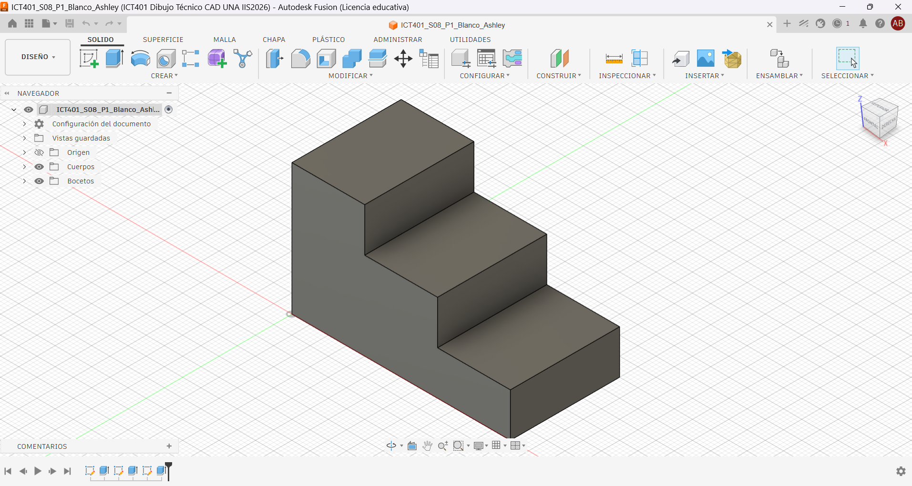
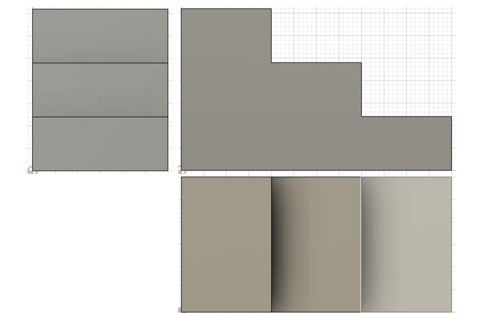
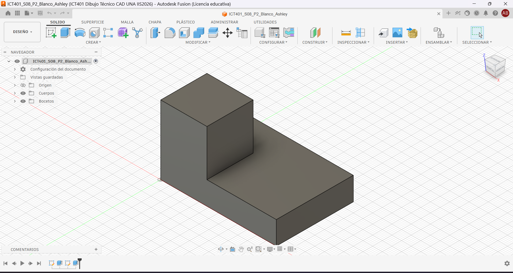
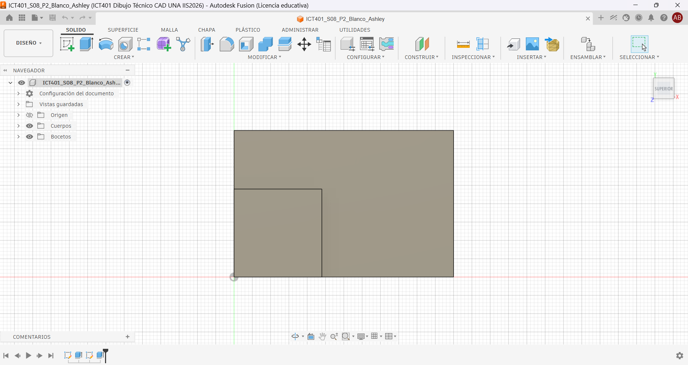
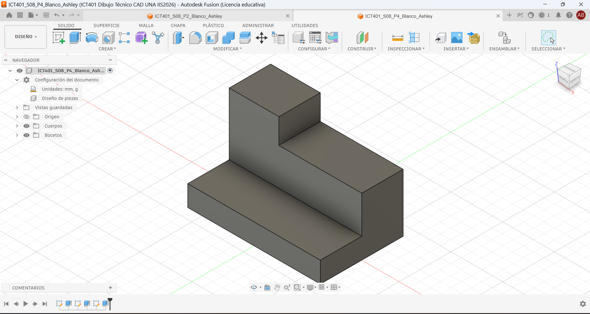
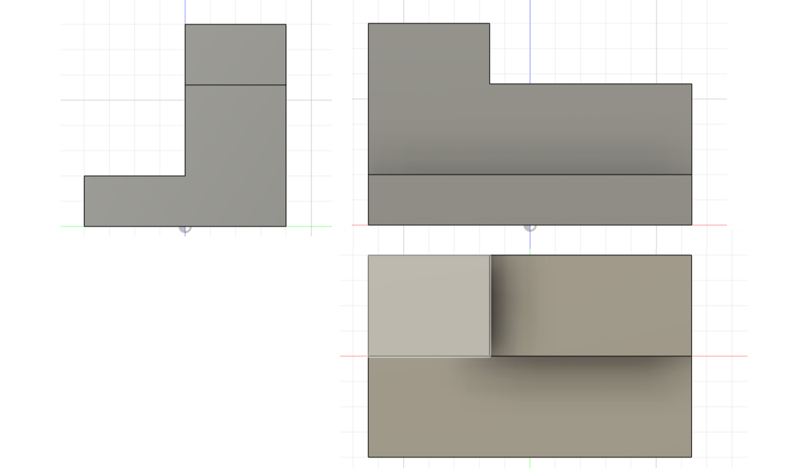
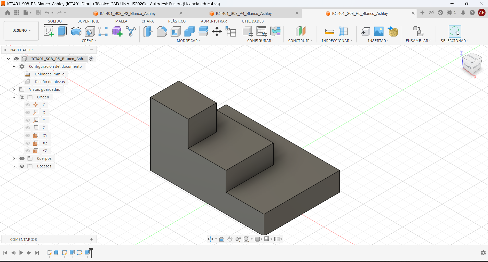
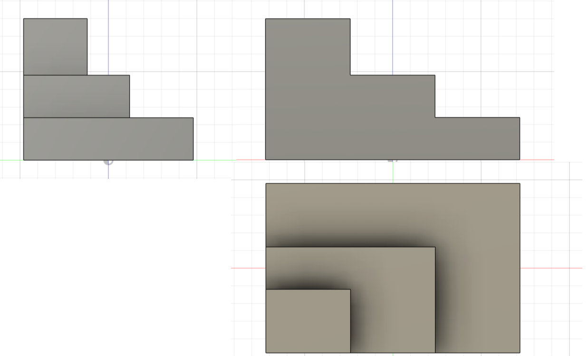

# ICT401 · Semana 8 — Registro formativo de práctica en Fusion

7 al 12 de septiembre de 2026. V Congreso Universitario. Consolidación de contenidos. Sin evaluaciones.

- Estudiante: [Ashley Blanco Solis]
- Grupo: [60]
- Carpeta o proyecto de Fusion Cloud con acceso docente (sin enlaces privados): [Semana 08/S08_Registro_Blanco_Ashley.md]
- Modelos proporcionados: `S08_P1_Modelo_Observacion.f3d` y, después de P2, `S08_P2_Modelo_Comprobacion.f3d`.
- Copias personales: `ICT401_S08_P1_Blanco_Ashley` y `ICT401_S08_P2_Blanco_Ashley`.
- Diseños propios: `ICT401_S08_P4_Blanco_Ashley` y `ICT401_S08_P5_Blanco_Ashley`.

## Instrucciones

Copie esta plantilla a `Portafolio/semana08/` y guárdela como `S08_Registro_Apellido_Nombre.md`. Sustituya `Apellido_Nombre` en todos los nombres y enlaces por un apellido y un nombre sin espacios ni tildes. Complete cada [Respuesta], agregue las ocho imágenes en esa misma carpeta y haga commit. No necesita construir otra plantilla.

Escriba las predicciones y decisiones iniciales antes de comprobar. **Nunca borre una respuesta inicial incorrecta:** conserve lo escrito y agregue la corrección y su causa en el apartado posterior. Use la guía para los recursos gráficos y los tiempos de cada P1–P5 (50 minutos cada uno).

X = ancho, Y = profundidad, Z = altura; milímetros. Primer diedro: Right a la izquierda de Front y Top debajo de Front. Cámara ortográfica. Los montajes documentan correspondencia, no son planos a escala: compruebe dimensiones con Measure, no con píxeles. Combine capturas con una herramienta de imágenes o diapositivas y guarde un único PNG por nombre; no deforme imágenes ni oculte el ViewCube. Los recortes temporales no se entregan.

## P1 — Del modelo 3D a las vistas

### P1.1 · Antes de seleccionar Front, Top o Right: ¿qué características, caras y aristas espera ver en cada vista y qué dimensiones aparecerán horizontal y verticalmente?

**Frontal:** se vería la altura de la pieza y los niveles de las escaleras. Dimensiones: horizontal = ancho, vertical = altura.

**Superior:** se verá la forma de un rectángulo con 3 líneas verticales. Dimensiones: horizontal = ancho, vertical = profundidad.

**Derecha:** se verá la forma de un rectángulo en vertical con 3 líneas horizontales. Dimensiones: horizontal = profundidad, vertical = altura.

### P1.2 · ¿Cuál vista considera inicialmente más informativa y por qué?

**Frontal**.. porque solo con ver la figura desde esta vista se sebe que es una forma escalonada, y a que dirección van los escalones. Mientras que en las otras no se sabría el largo de los escalones.

### P1.3 · Después de observar Front, Top y Right: ¿qué predicciones confirmó y qué corrigió? Explique por qué sin borrar su respuesta inicial.

**Frontal:** Se confirmó la predicción.

**Superior:** las líneas verticales eran 2 en lugar de 3.

**Derecha:** las líneas horizontales eran 2 en lugar de 3.

### P1.4 · ¿Qué pares de vistas comparten ancho, altura y profundidad? Anote el valor comprobado en milímetros y la arista seleccionada.

| Vista|Dimensión | Valor (mm) y arista ||
|---|---|---|---|
| Frontal y superior | Ancho (eje X) | 60mm-arista de la base horizontal |
| Frontal y derecha | Altura (eje Y) | 36mm-arista vertical de todo el objeto |
| Superior y derecha | Profundidad (eje Z) | 30mm- arista de la base horizontal |

### P1.5 · Elija una característica tridimensional: ¿cómo aparece en dos vistas diferentes? Identifique las caras o aristas relacionadas.

**Escalón Superior:**
-En la vista Superior aparece como el primer rectángulo vertical a la izquierda. Dentro del objeto.

-En la vista derecha aparece como el primer rectángulo en la parte superior. dentro del objeto.

-Primera y segunda arista vertical de la izquierda,de la parte superior.
Primera y segunda arista horizontal de la parte superior, de la vista derecha.

| Vista | Predicción inicial: características y dimensiones | Observación posterior | Corrección y causa |
|---|---|---|---|
| Front | [Escalones visibles; dimensiones: ancho (X) y altura (Y).] | [Se confirmó la altura y los tres niveles.] | [Sin corrección] |
| Top | [Escalones en plano; dimensiones: ancho (X) y profundidad (Z).] | [Se confirmó los escalones en plano] | [Sin corrección] |
| Right | [Rectángulo con 2 líneas horizontales; dimensiones: profundidad (Z) y altura (Y).] | [Se confirmó los escalones en plano, con líneas horizontales] | [Sin corrección] |

| Dimensión compartida | Par de vistas | Valor (mm) y arista seleccionada |
|---|---|---|
| Ancho | [Frontal y Superior] | [60 mm — arista de la base horizontal] |
| Altura | [Frontal y Derecha] | [36 mm — arista vertical izquierda del objeto de frente] |
| Profundidad | [Superior y Derecha] | [30 mm — arista de la base horizontal] |

### Evidencias

Modelo completo en orientación pictórica, ViewCube y nombre de su copia visibles.

Un montaje de tres capturas de Fusion: Right a la izquierda, Front a la derecha y Top debajo de Front; etiquetas y cuerpo completo visibles.

## P2 — De las vistas al modelo mental

### P2.1 · ¿Qué forma general imagina y cuáles son sus cambios de altura?

[La pieza se imagina como una forma en L escalonada, tenía dos alturas]

### P2.2 · ¿La profundidad se mantiene o cambia entre zonas? Relacione las tres vistas.

[Se mantiene, son la misma en Top y Right]

### P2.3 · ¿Qué correspondencias encuentra entre vistas?

[Front y Right: Altura. 

Front y Top: Ancho.

Top y Right: Profundidad .]

### P2.4 · ¿Qué información aporta Top y qué información aporta Right?

[Top: Ancho y largo total de la pieza.

Right: La altura total de la pieza y la diferencia de alturas en los niveles.]

### P2.5 · Describa verbalmente la pieza imaginada antes de mirar las alternativas.

[Un bloque rectangular, con un cuadrado o cubo en una esquina, que desde el frente parece una L]

### P2.6 · ¿Selecciona A, B, C o D? Justifique antes de comprobar y descarte cada una de las otras tres mediante una vista.

[El modelo B es justo lo que imaginaba,(Hice primero P3, por lo que tenia una idea de como era el objeto)]

### P2.7 · Después de comprobar: ¿fue correcta su selección, qué interpretó incorrectamente si falló y qué vista fue decisiva? Conserve la selección inicial y explique la corrección.

[La selección es correcta: el modelo B coincide.
No hubo error de interpretación. La vista Top fue la decisiva]

| Alternativa | Justificación inicial: seleccionar o descartar | Vista que apoya mi decisión |
|---|---|---|
| A | [Se descarta: Tiene otro rectángulo arriba, en ves de un cubo.] | [Right] |
| B | [Se selecciona: Es la mas parecida a lo que imagine.] | [Top] |
| C | [Se descarta: El cubo de arriba no esta del lado correcto.] | [Front] |
| D | [Se descarta: El cubo de arriba aparece ser mas corto.] | [Right] |

### Evidencias

Modelo correcto proporcionado por el docente durante la comprobación, en orientación pictórica, con nombre y ViewCube visibles.

## P3 — Detectives de vistas

### P3.1 · Caso A: ¿qué vista parece incorrecta, qué línea produce la inconsistencia, con cuál otra vista entra en contradicción y cómo debería corregirse?

[La vista incorrecta es la Top. La línea interna no corresponde al objeto. Contradice el lado Frontal. Se corrige quitando la parte derecha de la segunda arista horizontal]

### P3.2 · Caso B: ¿qué dimensión debería conservarse, dónde aparece la contradicción, qué información permite comprobarla y cómo debería corregirse?

[La dimensión que debe conservarse es la profundidad real que es la Right( 40mm). La contradicción está entre Top y Right. Se comprueba con en Fusion. Se corrige ajustando la vista superior a 40 mm en lugar de 48mm]

### P3.3 · Caso C: ¿cuál vista no pertenece al conjunto, qué característica lo demuestra, con cuáles vistas entra en contradicción y qué debería mostrar una vista correcta?

[La vista que no pertenece es la Front. Muestra la parte posterior del objeto. Contradice a Top y Right. Una vista correcta debería mostrar el rectángulo alineado con el cuadrado de Top..]

### P3.4 · Para cada caso: ¿qué acción realizó en Fusion, qué observó y cómo corrigió su hipótesis inicial?

[**A:** Alterné entre Front y Top; observé que la línea interna no existía; corregí quitando la arista.

**B:**  Alterné entre Top y Right; comprobé que la profundidad real era 40 mm; corregí ajustando la Top.

**C:** Orbité el modelo; comprobé que la Front mostraba la parte trasera; corregí descartando esa vista.]

### P3.5 · ¿Qué caso documentó en la captura y qué detalle demuestra el error?

[El Caso B. El detalle que demuestra el error es la diferencia de profundidad: 48 mm vs 40 mm.]

| Caso | Hipótesis inicial | Acción en Fusion y observación | Corrección y causa |
|---|---|---|---|
| A | La Top tenía una línea interna incorrecta. | Alterné vistas y confirmé que no existía. | Se quitó la parte derecha de la segunda arista horizontal.|
| B | La profundidad no coincidía entre Top y Right. | Medí con Medir: real = 40 mm. | Se corrigió Top para que coincida en 40 mm. |
| C | La Front mostraba la parte posterior. | Orbité y comprobé que no correspondía. | Se descartó la Front y se reconoció que no pertenece.|

### Evidencias

Una vista de Fusion que compruebe uno de los errores; nombre y ViewCube visibles. Para el caso B, incluya Measure con la arista completa y su longitud.

## P4 — Reconstrucción 3D guiada

### P4.1 · Antes de abrir Fusion: indique ancho total, altura máxima, profundidad total y número de niveles o cambios principales.

[Ancho total (X): 64 mm

Altura máxima (Z): 40 mm

Profundidad total (Y): 40 mm

Niveles principales: 3 cambios de altura (10 mm, 28 mm y 40 mm)]

### P4.2 · ¿Qué vista usará como referencia, qué plano inicial elegirá y cómo será su boceto base? Justifique relacionando las vistas.

[La vista de referencia será la Top, porque puedo ver el  ancho y la profundidad.
El plano inicial será XY.
El boceto base será un rectángulo de 64 × 40 mm,centrado.
]

### P4.3 · ¿Cuál será su primera operación 3D y qué características posteriores prevé? Justifique.

[La primera operación será un extrude del rectángulo principal, de 10 mm de altura.
Luego se tendría que hacer otro rectángulo de 20mm de profundidad y luego un otro de 20mm en una esquina]

### P4.4 · Después de construir: ¿coincide Front, coincide Top y coincide Right? Para cada vista cite un contorno, una arista y una dimensión comprobada.

[Front: coinciden los escalones; arista vertical comprobada de altura=40 mm; ancho=64 mm.

Top: coincide el rectángulo dividido; arista horizontal del medio de 64 mm; profundidad=20 mm.

Right: coincide la profundidad de los escalones; aristas horizontales=40,20 y 20 mm; alturas=10,18 y 12 mm.]

### P4.5 · ¿Qué fue necesario corregir y qué Sketch, operación o dimensión controlaba la corrección? Si no hubo cambios, justifique con una comprobación.

[No fue necesario cambiar nada: las tres vistas coincidieron.
La comprobación se hizo midiendo en Fusion las aristas y los apuntes del profesor]

| Vista | ¿Coincide? | Contorno y arista | Dimensión comprobada (mm) | Corrección y causa |
|---|---|---|---|---|
| Front | [Sí] | [Contorno en “L”; aristas verticales de los lados] | [Altura 40,28 y 10mm] | [No hubo corrección, coincidió con el modelo] |
| Top | [Sí] | [Rectángulo dividido horizontalmente; arista horizontal del medio ] | [Profundidad 40 y 20mm] | [No hubo corrección, coincidió con el modelo] |
| Right | [Sí] | [Contorno en “L” volteada; aristas verticales de los lados] | [Altura 40,28 y 10mm] | [No hubo corrección, coincidió con el modelo] |

### Evidencias

Modelo terminado completo en orientación pictórica, nombre del diseño y ViewCube visibles.

Montaje con tres pares: vista de referencia de esta guía junto a su correspondiente vista de Fusion. Disponga Right a la izquierda, Front a la derecha y Top debajo de Front.

## P5 — Reto de reconstrucción autónoma

### P5.1 · Antes de modelar: indique ancho total, altura máxima y profundidad total.

Ancho total: 72 mm

Altura máxima: 40 mm

Profundidad total: 48 mm

### P5.2 · ¿Qué vista elegirá para comenzar, qué plano inicial y qué primera operación prevé? Justifique.

[Usaré Top (XY) como referencia porque se el ancho y profundidad total.
El plano inicial será XY.
La primera operación será un extrude de 12mm en el regtangulo inical.]

### P5.3 · ¿Qué características posteriores prevé, cuál es la más difícil de interpretar y qué vistas necesita relacionar para comprenderla?

[Hacer los otros dos escalones, ancho y profundidad de estos. Tengo que relacionar Top y Right ]

### P5.4 · Después de construir: ¿coinciden Front, Top y Right? Para cada vista cite un contorno, una arista y una dimensión comprobada.

[Front: coincide el contorno de escalones; arista vertical izquierda=40 mm; ancho 72 mm.

Top: coinciden los niveles con cortes horizontales; aristas horizontales 24 y 48 mm; profundidad Y=48 mm.

Right: coincide el contorno de escalones; arista Horizontales 30 y 48 mm; altura Z=40 mm.]

### P5.5 · ¿Funcionó la estrategia inicial, qué tuvo que modificar, qué vista permitió detectarlo y qué haría diferente si reconstruyera nuevamente la pieza?

[La estrategia inicial funcionó.
Si reconstruyera otra vez, haría un boceto mas elaborado con las medidas claras.]

| Vista | ¿Coincide? | Contorno y arista | Dimensión comprobada (mm) | Corrección y causa |
|---|---|---|---|---|
| Front | [Sí] | [Escalones en 12 y 24mm,aristas horizontales] | [Ancho 72] | [No hubo corrección] |
| Top | [Sí] | [rectángulo pequeño de 18 y 24,aristas verticales de 18mm ] | 
[Profundidad 48] | [No hubo corrección] |
| Right | [Sí] | [Escalones en 12 y 24mm,aristas horizontales] | [Altura 40] | [No hubo corrección] |

### Evidencias

Modelo terminado completo en orientación pictórica, nombre del diseño y ViewCube visibles.

Montaje con tres pares: vista de referencia de esta guía junto a su correspondiente vista de Fusion. Disponga Right a la izquierda, Front a la derecha y Top debajo de Front.

## Reflexión final

Una vista por sí sola puede ser insuficiente porque:

[No muestra toda la forma y las medidas de la pieza.]

Para relacionar correctamente varias vistas debo comprobar:

[Que las medidas y las líneas coincidan entre las vistas.]

Antes de comenzar una reconstrucción 3D conviene:

[Revisar bien las medidas del plano]

La diferencia principal entre lo que hice en Semana 7 y Semana 8 es:

[En la semana 8 aprendí a leer bocetos y formar un objeto según ese boceto sin ayuda.]

Lo que todavía necesito practicar antes de reconstruir una pieza a partir de un plano es:

[hacer un boceto por mi misma para entender mejor la forma y las medidas de las piezas]

## Checklist

- [x ] Completé P1 antes y después de observar las vistas.
- [ x] Justifiqué mi selección en P2.
- [ x] Identifiqué y comprobé inconsistencias en P3.
- [ x] Planifiqué P4 antes de comenzar a modelar.
- [ x] Comprobé P4 contra las tres vistas originales.
- [ x] Realicé P5 con mayor autonomía.
- [ x] Comprobé P5 contra las vistas originales.
- [ x] Respondí las preguntas de reflexión.
- [ x] Las ocho imágenes se visualizan correctamente en GitHub.
- [ x] Mis modelos P4 y P5 están disponibles para revisión docente en Fusion Cloud.
- [ x] Conservé mis predicciones iniciales aunque fueran incorrectas.
- [ x] Expliqué las correcciones realizadas.
- [ x] El commit utiliza el mensaje solicitado.

Commit: `S08 ejercicios Fusion Apellido Nombre`. 

Corrección posterior: `S08 correccion Fusion Apellido Nombre`.

Abra el registro en GitHub y compruebe los ocho enlaces. Los archivos nativos permanecen en Fusion Cloud con acceso docente. Este registro conserva práctica formativa y no constituye una entrega evaluada de portafolio.
