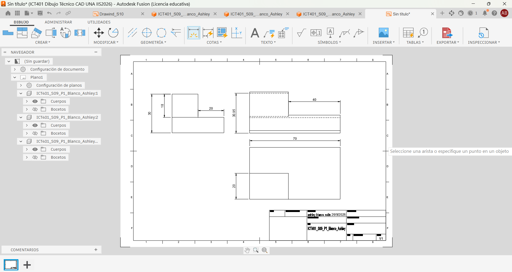
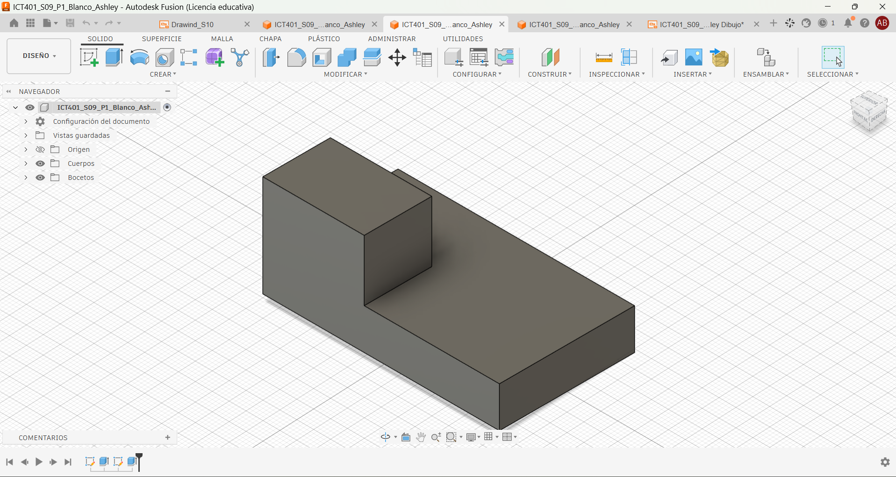
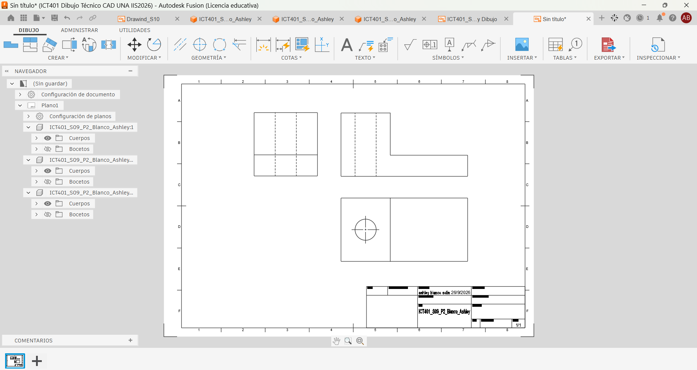
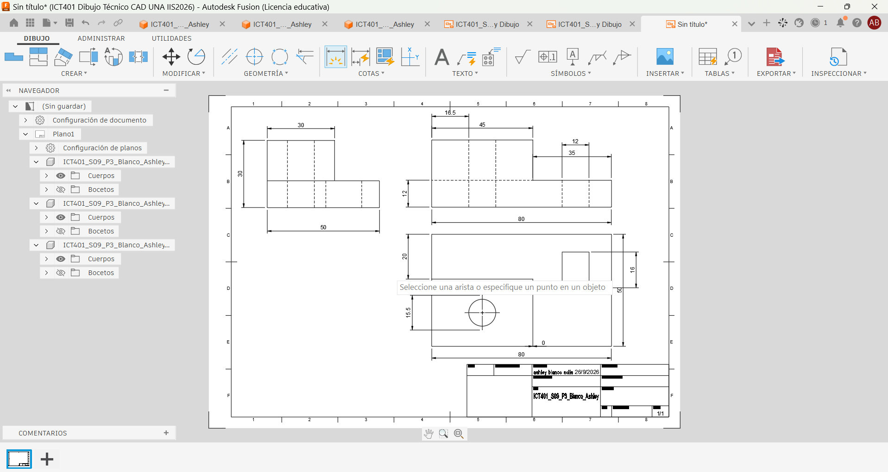
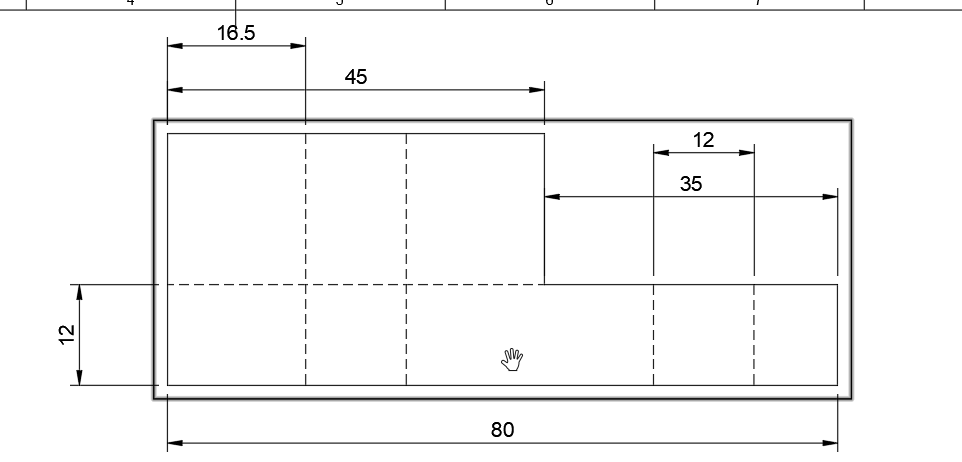
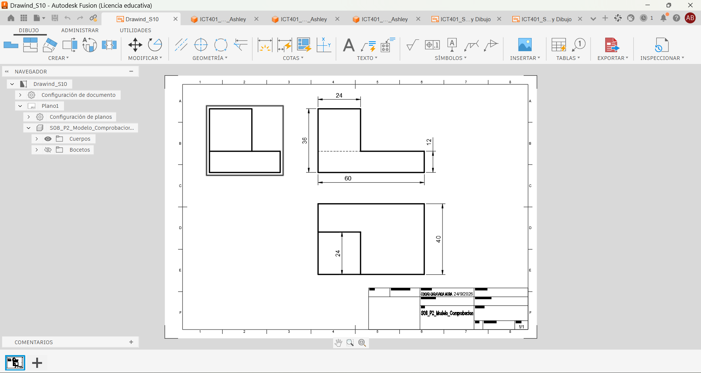
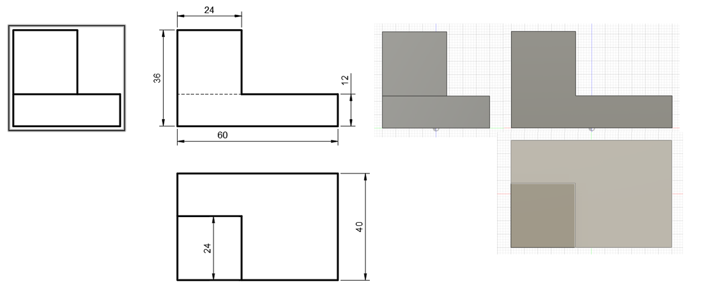

# ICT401 · Semana 10 — Registro de vistas técnicas y acotación normalizada

21 al 26 de septiembre de 2026.

- Estudiante: Ashley Blanco
- Grupo: 60
- Carpeta o proyecto de Fusion Cloud con acceso docente: [Respuesta]
- Modelos utilizados: `ICT401_S09_P1_Blanco_Ashley`, `ICT401_S09_P2_Blanco_Ashley`, `ICT401_S09_P3_Blanco_Ashley` u otros equivalentes.

## Instrucciones

Copie esta plantilla a `Portafolio/semana10/` y guárdela como `S10_Registro_Blanco_Ashley.md`. Sustituya `Apellido_Nombre` por un apellido y un nombre sin espacios ni tildes. Complete cada `[Respuesta]`, agregue las imágenes solicitadas en la misma carpeta y haga commit.

Documente cada decisión de selección de vistas y acotación. Si modifique una decisión durante el proceso, no borre lo anterior: describa qué cambio, qué evidencia del modelo o del Drawing motivó la corrección y qué ajuste realizó.

X = ancho, Y = profundidad, Z = altura. Trabaje en milímetros. Cuando compare vistas, mantenga Front, Top y Right con orientación coherente y cámara ortográfica.

---

## P1 — Del modelo 3D a las vistas técnicas

### P1.1 · Modelo utilizado

- Nombre del diseño en Fusion: [Respuesta]
- Pieza de referencia (semana de origen): semana 09

### P1.2 · Características principales del modelo

| Característica | Descripción | Vista(s) que la comunican |
|---|---|---|
| 1 | Base rectangular grande | Front, Top |
| 2 | Rectángulo superior mas pequeño| Top, Right |
| 3 | Semi forma de ´L´| Front, Right |
| 4 | Ancho total delo objeto| Front, Top |

### P1.3 · Vistas seleccionadas y justificación

| Vista | ¿Es necesaria? | ¿Por qué? | ¿Qué información aporta? |
|---|---|---|---|
| Front | Sí | Es la primera vista que se ve|  Muestra altura y ancho total del objeto |
| Top | Sí |  Enseña la forma del boceto| Muestra la profundidad total de los dos escalones |
| Right | Sí | Muestra lo que hay del lado derecho  |  Muestra que la base es el doble de ancho que el escalón de arriba  |
| Otra: Left | Es útil pero no necesaria  | La información la dan las otras 3 vistas | Muestra que la base es el doble de ancho que el escalón de arriba |

### P1.4 · ¿Algual vista resultó redundante? ¿Cuál y por qué?

- Left: La información que daba la dieron las demás vistas.

### P1.5 · Método utilizado para generar las vistas en Fusion

-desde la pieza abierta..--Diseño--Dibujo--seleccionar--manual--aceptar--pegar la primera vista.. Luego en crear-- vista base---orientación--elegir vista y escala---aceptar.

### Evidencias P1

Captura de las vistas ortogonales generadas desde el modelo.

Modelo 3D en orientación isométrica con nombre y ViewCube visibles.

---

## P2 — Creación del plano desde el modelo

### P2.1 · Configuración del Drawing

- Formato seleccionado:A3
- Orientación: Horizontal
- Escala: 2:1
- Justificación de cada elección: A3 es el tamaño predeterminado para la pieza.

Horizontal porque acomoda mejor las tres vistas alineadas.

Escala 2:1 para que sea facil de4leer sin que sea demaciado grande( me gusta es escala).

### P2.2 · Disposición de vistas

| Vista | Posición en el Drawing | Distancia a la vista adyacente | ¿Alineada correctamente? |
|---|---|---|---|
| Front (base) | Arriba a la derecha | Distancia uniforme | Sí |
| Top | | Bajo de Front | Distancia uniforme | Sí |
| Right | A la izquierda de Front | Distancia uniforme | Sí |

### P2.3 · ¿Qué problemas de alineación o disposición detectó? ¿Cómo los resolvió?

-Right salió muy alejado de Front a comparación de Top. Lo resolví seleccionado a Right y posicionándolo un poco mas cerca a Front.

### P2.4 · ¿La escala permite legibilidad de todas las vistas? Justifique.

-Sí. Con la escala 2:1 las medidas y detalles se ven claros sin necesidad de acercar demasiado.

### Evidencias P2

Captura del Drawing con las tres vistas insertadas y alineadas.

---

## P3 — Acotación normalizada básica

### P3.1 · Dimensiones generales aplicadas

| Dimensión | Valor | Vista donde se colocó | Justificación |
|---|---|---|---|
| Ancho total (X) | 80 mm | Front| Muestra el ancho completo de la pieza|
| Profundidad total (Y) |50 mm | Top | Muestra la profundidad total de la base |
| Altura total (Z) | 30 mm | Right  | Muestra la altura completo de la pieza |

### P3.2 · Dimensiones parciales y funcionales

| Característica | Dimensión | Valor | Vista | ¿Repetida en otra vista? |
|---|---|---|---|---|
| Sección escalonada | ancho | 45 mm  | Front | si |
| Sección escalonada | Profundidad| 30 mm| Right | si |
| Corte rectangular | Profundidad | 16 mm| Top |si  |
| Orificio circular | Posición centro | 15.5 mm diametro | Top | Sí, |

### P3.3 · ¿Eliminó alguna cota por redundante? ¿Cuál?

-No.

### P3.4 · ¿Alguna dimensión quedó dentro del contorno de la vista? ¿Qué hizo al respecto?

-Sí, las cotas se movieron hacia afuera.

### P3.5 · ¿Qué criterio de organización utilizó para disponer las cotas?
-Ninguno, solo las puse donde fueran visibles,facil de entender y no hubiera tantas cotas.

### Evidencias P3

Captura del Drawing con las cotas aplicadas.

Detalle de una zona del plano donde se aprecie la organización de las cotas.

---

## P4 — Práctica guiada de plano técnico

### P4.1 · Pieza documentada

- Nombre del diseño: S10_P4_Práctica_guiada_plano_técnico
- Pieza de referencia: S08_P2_Modulo_Comprobacion

### P4.2 · Vistas generadas

| Vista | Información que comunica | Cotas asignadas |
|---|---|---|
| Front | Altura total (36 mm), ancho completo (60 mm), escalón vertical |  |
| Top |  | Profundidad total(40 mm), prfundidad del escalon(24 mm)|
| Right | Planta con forma en “L” | |

### P4.3 · Resumen de cotas aplicadas

| Tipo de dimensión | Cantidad | Ejemplo |
|---|---|---|
| Generales | 3 | Altura total 36 mm |
| Parciales | 1 | Altura de base 12 mm |
| Funcionales | 2 | Escalon de 24 mm de profundidad|

### P4.4 · ¿El plano contiene información suficiente para fabricar la pieza? ¿Falta algo?

-si, no falta nada.

### P4.5 · Errores encontrados y correcciones realizadas

| Error detectado | Corrección aplicada | Vista afectada |
|---|---|---|
|ninguno | ninguno | ninguno |
| ninguno| ninguno |ninguno |

### Evidencias P4

Drawing completo con vistas y cotas.

Comparación del Drawing con el modelo 3D.

---

## Reflexión final

La diferencia principal entre documentar una pieza en Semana 9 (reconstrucción desde plano) y documentarla en Semana 10 (generación de vistas desde modelo) es:

-En Semana 9 se inicia de un plano y se reconstruye la pieza. En Semana 10, se trabaja desde el modelo 3D en Fusion, y luego se hace el plano.

Los criterios que utilicé para seleccionar las vistas necesarias fueron:

-Elegí las vistas que muestran la altura, ancho y profundidad de la pieza .

Los principios de acotación normalizada que más influyeron en la claridad de mi plano fueron:

-Colocar las cotas fuera del contorno de la pieza.( diria que no repetir informacion ,pero prefiero confirmar la informacion desde otra avista)

Si tuviera que agregar una vista adicional a una de mis piezas, sería:

-Me gustaría agregar la isotermica.

## Checklist

- [x ] Seleccioné las vistas necesarias y justifiqué cada una.
- [x ] Generé las vistas ortogonales correctamente alineadas.
- [x ] Configuré formato, orientación y escala de manera coherente.
- [x ] Apliqué dimensiones generales, parciales y funcionales.
- [x ] Evité cotas repetidas, ambiguas o innecesarias.
- [x ] Organice las cotas fuera del contorno de las vistas.
- [x ] El plano contiene información suficiente para fabricar la pieza.
- [x ] Documenté errores y correcciones sin borrar decisiones iniciales.
- [x ] Las evidencias se visualizan correctamente en GitHub.
- [x ] Los Drawing están disponibles en Fusion Cloud con acceso docente.
- [x ] Completé la reflexión final.

## Cierre del Portafolio Técnico 2

La revisión del portafolio abarca las **semanas 6 a 10**. El plazo para completar y publicar los pendientes de **Semana 10** es el **viernes 25 de septiembre de 2026, a las 11:59 p. m., hora de Costa Rica**. Este plazo no habilita correcciones de las semanas 6 a 9.

Antes del cierre verifique:

- [x ] Las fichas de las semanas 6--10 están completas en `Portafolio/semanaXX/`.
- [x ] Las imágenes y enlaces se visualizan correctamente desde GitHub.
- [x ] Las correcciones están documentadas sin borrar respuestas iniciales.
- [x ] Los modelos están disponibles en Fusion Cloud con acceso docente.
- [x ] Los últimos cambios están publicados en GitHub.

Commit sugerido: `S10 ejercicios Fusion Blanco Ashley`.

Corrección posterior: `S10 correccion Fusion Blanco Ashley.
